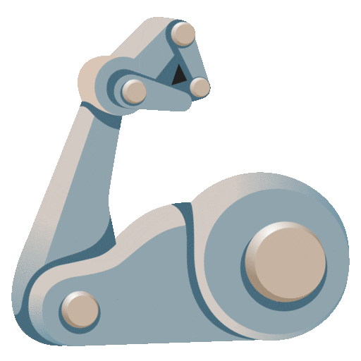

<h1 align="center">  
  
  
  

  Kartikeya Sharma
  

</h1>

<h4 align="center">

```Deep Learning Enthusiast```
</h4>

<text align="center">

I am an indie developer specializing in <strong>Deep Learning</strong> and <strong>Computer Vision</strong>. With a strong foundation in my field, I have a special passion towards 'building from scratch'. I build resilient Deep Learning pipelines that prioritize scalability and productivity.

</text>

<h2 align="center"> 

🧰 Languages and Tools 


<br />

</h2>

<hr>

<h2 align="center">
    📺 Projects
</h2>

<h3 align="center">
<br>

Alzheimer Prediction from MRI

<a href="https://alzheimer-detection.onrender.com/">Deployed Application</a> and <a href="https://github.com/Kartikeya2710/alzheimer-prediction">Training Pipeline</a>


<br>
<br>
<br>

Smart Traffic Engagement and Management System (STEMS)

<a href="https://github.com/Kartikeya2710/STEMS">GitHub Repository</a>


</h3>

---

<h2 align="center">
Let's Connect
<h2>

<h3 align="center">
<a href="https://www.linkedin.com/in/kartikeya-rahul-sharma/"></a>
<a href="mailto:kartikeyasharma27@gmail.com"></a>
</h3>


[linkedin]: https://www.linkedin.com/in/kartikeya-rahul-sharma/